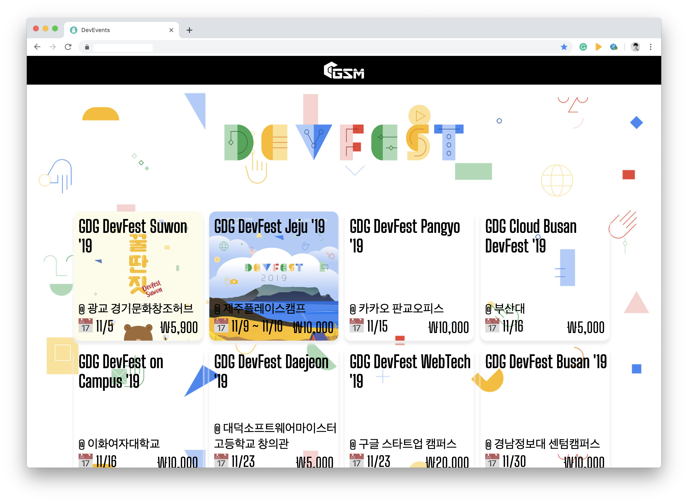

# MingledJumble

A collection of diverse web pages📃 that I wanted to create.😎

## 👪 Contributor(s)

Everyone can open an issue or pull request anytime.

- [🔗Unperknown](https://github.com/Unperknown)

## 🔑 Technology Stacks

## Project 1 - Developers' Events Notification

This website lets people know what events related to developers are held every month.

### Initial Deployment!

<iframe src="https://giphy.com/embed/J2n3nsmSiX8t9l45mj" width="480" height="319" frameBorder="0" class="giphy-embed" allowFullScreen></iframe>
<a href="https://giphy.com/gifs/J2n3nsmSiX8t9l45mj">via GIPHY</a>

### Daily Progress

#### 10/15 ~ 10/16 - Web Hosting Test Turned Out Well!

Ubuntu VPS 서버에서 Nginx를 활용하여 Node.js Application을 도메인에 호스팅할 수 있도록 하였다. 앞으로 전체적인 요구 사항은 다음과 같다.
1. 메인 페이지는 개발자 행사의 목록으로 이루어져 있고 개발자 로드맵 페이지 이동할 수 있는 요소가 있어야 한다.
2. 개발자 로드맵은 웹 페이지로 한 눈에 알아볼 수 있도록 한다.
3. 가능하다면 행사 관련 사이트의 데이터를 크롤링할 수 있도록 해야 한다.

Pros
- 웹 호스팅의 과정을 직접 구현하면서 세심히 알아볼 수 있었고 Nginx에 대해서 배울 수 있었다.
- 올해 초에 Ubuntu OS를 경험한 적이 있어서 더욱 쉽게 서버 시스템을 관리할 수 있었다!

Cons
- 도메인 및 서버를 구매하는 데 비용이 많이 들었다.
- 앞으로 웹 UI/UX를 설계하고 전체적인 디자인을 해야 한다.
- 웹사이트에 대한 구체적인 요구사항을 정해야 한다.

#### 10/17 - Designed Favicon

Favicon을 디자인했다.

#### 10/18, 10/21 - HTTPS/SSL Connection Configuration

도메인에 대한 SSL 인증서를 구매하여 HTTPS 연결이 되도록 하였다.

Pros
- 서버 연결이 암호화되어 보다 **보안**을 갖출 수 있게 되었다!

Cons
- HTTPS 연결을 위해서 수정해야 할 각 작업들을 파악하는 데 헤매서 시간이 많이 걸렸다.(방화벽 HTTPS 연결 허용, SSL 인증서 설정 등)

#### 10/22 - Main Page Design

메인 페이지에 대한 간단한 프로토타입을 짰다.

Pros
- 웹사이트의 가장 중요한 부분의 전체적인 틀이 갖추어지게 되었다.

Cons
- 저작권에 대한 결정을 해야 한다. 이 웹사이트는 비상업적인 사이트로 저작권은 없는 것으로 처리하려고 한다.

#### 10/25, 10/27 - Loaded JSON Data On Website, Responsive Web UI

행사 내용에 대한 JSON Data를 불러오도록 하였다. 현재 일반적인 크기의 브라우저밖에 지원을 안하지만 모바일, 태블릿 등에서도 UI가 깨지지 않도록 해야 한다.

Pros
- 행사 내용과 관련된 데이터를 '서버에서' 불러올 수 있어서 앞으로 크롤링까지 더하면 자동화할 수 있게 된다.

Cons
- 데이터 크롤링에 대한 설계를 해야 한다.
- 반응형 UI를 추가적으로 적용해야 한다.

#### 10/30 - Initial Deployment!

현재까지 진행한 스프린트는 다음과 같이 이루어졌다.
- HTTPS로 연결되는 Nginx 서버에서 Node.js Application을 배포할 수 있도록 하였다.
- 행사 정보를 알 수 있고 그와 관련된 신청 웹 사이트로 이동할 수 있는 UI를 디자인하고 구현하였다.

다음에 진행해야 할 스프린트 작업 목록은 아래와 같이 정했다.
- 현재 웹 서비스를 Dockerize한다. (기존에 FTP로 전송하는 배포 프로세스를 더 간편하게 할 것이다.)
- 행사 관련 정보에 대한 CRUD를 구현한다. (행사 관련 사이트에서 데이터를 크롤링한다, 행사 데이터의 CRUD를 건드리는 관리자 모드를 구현한다, 행사 정보를 유저가 올릴 수 있도록 한다 등)
- 전체적으로 웹 성능을 최적화할 수 있도록 한다. (Resource를 gzip로 배포한다, CDN(Cloudflare)를 적용한다 등)
- Domain에 Search Engine Optimization을 적용하여 검색 엔진에 조회될 수 있도록 한다.

#### 10/31 - Web Application Dockerizing... & Search Engine Optimization

웹 서비스 배포 프로세스를 더 간편하게 할 수 있도록 도커라이징을 하고 있다.

## Project 2 - Unperknown's Résumé

Everyone can see Unperknown's résumé at this website.
(Probably working on around November)

## Project 3 - The School Community with Conversation Service (Progressive Web App)

This web-app allows the school community to have communication with each other online.
(Assuming to start at December or next year)
